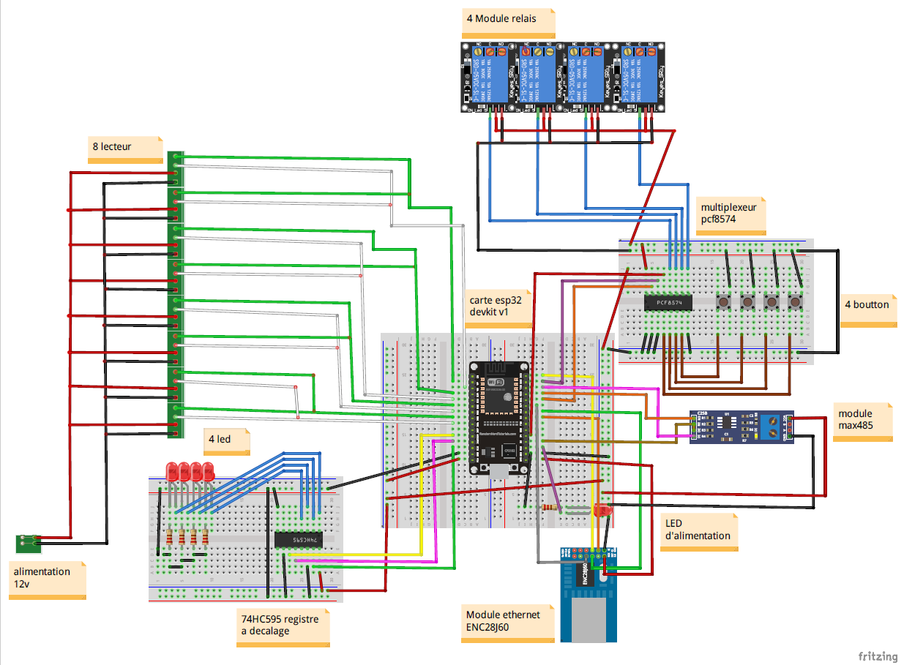

# Contrôleur d'Accès Multi-portes

## Description :

Les panneaux de contrôle d'accès sont utilisés pour gérer l'activité de contrôle d'accès au niveau du bâtiment. Ce projet vise à concevoir et réaliser un contrôleur permettant d'intégrer jusqu'à quatre portes à contact sec. Le contrôleur utilise des connexions RS485 et Wiegand pour la communication avec les lecteurs, ainsi qu'une connexion TCP/IP (REST API) pour communiquer avec le logiciel de gestion d'accès.

## Fonctionnalités :

- Intégration de jusqu'à quatre portes à contact sec.
- Connexions RS485 et Wiegand pour la communication avec les lecteurs.
- Connexion TCP/IP (REST API) pour la communication avec le logiciel de gestion d'accès.

## Schéma de Branchement :

## Matériel Utilisé :

- ESP32
- Module Ethernet ENC28J60
- Module RS485 MAX485
- Module relais 5V
- PCF8574
- Registre à décalage 74HC595
- Régulateur de tension LM7805

## Bibliothèques EUtilisé :

- [EthernetENC](https://github.com/JAndrassy/EthernetENCien_vers_github_ethernetenc)
- [PCF8574_library](https://github.com/xreef/PCF8574_library)
- [SSLClient](https://github.com/OPEnSLab-OSU/SSLClient)
- [Yet_Another_Arduino_Wiegand_Library](https://github.com/paulo-raca/YetAnotherArduinoWiegandLibrary)

## Installation et Configuration

1. Clonez ce dépôt sur votre ordinateur.
2. Installez les dépendances du projet (listées dans le fichier `Code/controleur_4portes`).
3. Connectez les composants selon le schéma de branchement.
4. Téléversez le code sur votre ESP32.

## Schémas PCB

## Contact

Pour toute question ou commentaire, n'hésitez pas à nous contacter à [habibdrira6@gmail.com].
